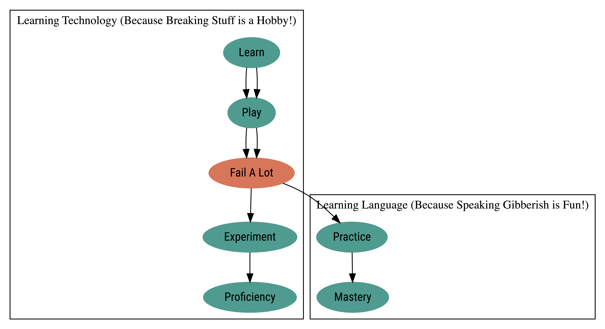

# My Scratch Pad

## What is Quarto

First I need to look up dictionary…

quar·to. /ˈkwôrdō/

*noun* **PRINTING**

noun: **quarto**; symbol: **4to**

- a size of book page resulting from folding each printed sheet into
  four leaves (eight pages).

  - a book of quarto size.

    plural noun: **quartos**

  - a size of writing paper, 10 in. × 8 in. (254 × 203 mm).

### What sort of Executable Cells Can I enter?

    If I'm using visual editor, from Insert I can insert  
    R, Python, Bash, Rcpp, SQL, D3, Stan, Julia , Mermaid, GraphViz

### Ooohh! I can even enter GraphViz!

{dot} will let me enter GraphViz!

<div>

<div>



</div>

</div>

{mermaid} will let me enter Mermaid too. Mermaid is often used with
Markdown-based documents, and it is suitable for Simple Diagram.

``` mermaid
graph LR;
  Learning[Start Learning] --&gt;|Confusion| Frustration[Frustration];
  Frustration --&gt;|Breakdown| Breakdown[Breakdown];
  Breakdown --&gt;|Google Everything| Google[Google Everything];
  Breakdown --&gt;|Caffeine Overdose| Caffeine[Caffeine Overdose];
  Breakdown --&gt;|Procrastination| Procrastination[Procrastination];
  Google --&gt;|Repeat| Repeat[Repeat Steps 1-7];
  Caffeine --&gt;|Repeat| Repeat;
  Procrastination --&gt;|Repeat| Repeat;
  Repeat --&gt;|Repeat| Learning;
  Repeat --&gt;|Eventually| Success[Success!];


```
